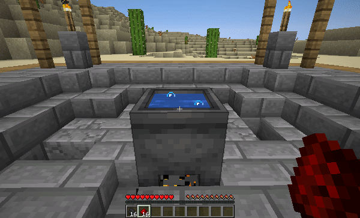

# 🕯 Алхимия

<figure><figcaption></figcaption></figure>


Для роботы [<mark style="color:purple;">данной</mark>](alkhimiya.md) механики нужно поставить **котёл** на огонь и подождать...&#x20;


## Доступные крафты

* **1x Beetroot:** 1x beetroot seeds + 1x bone meal
* **1x Wheat:** 1x wheat seeds + 1x bone meal
* **1x Pumpkin:** 1x pumpkin seeds + 2x bone meal
* **1x Melon:** 1x melon seeds + 2x bone meal
* **1x Wheat:** 1x wheat seeds + 1x bone meal
* **1x Beetroot Soup:** 1x bowl + 4x beetroot
* **1x Mushroom Stew:** 1x bowl + 1x brown + 1x red mushroom
* **1x Rabbit Stew:** 1x bowl + 1x brown/red mushroom + 1x cooked rabbit + 1x baked potato
* **4x Glow Berries:** 4x sweet berries + 1x glowstone dust
* **1x Coal Ore:** 2x coal + 1x stone
* **1x Diamond Ore:** 3x diamond + 1x stone
* **1x Emerald Ore:** 3x emerald + 1x stone
* **1x Gold Ore:** 2x gold + 1x stone
* **1x Iron Ore:** 2x iron + 1x stone
* **1x Copper Ore:** 2x copper + 1x stone
* **1x Lapis Ore:** 6x lapis lazuli + 1x stone
* **1x Redstone Ore:** 6x redstone + 1x stone
* **2x Fermented Spider Eye:** 1x spider eye + 1x brown mushroom + 1x sugar
* **2x Glowstone Dust:** 1x coal + 1x redstone
* **8x Concrete:** 8x concrete powder + 1x gravel _(all 16 variants)_
* **1x Emerald:** 500 villager essence + 1 diamond
* **1x Blaze Rod:** 50 blaze essence + 1 stick
* **1x Ghast Tear:** 250 ghast essence + 1 iron nugget
* **2x Gunpowder:** 50 creeper essence + 1 redstone
* **1x Ink Sac:** 25 squid essence + 1 black dye
* **1x Glow Ink Sac:** 50 squid essence + 1 glowstone
* **3x Leather:** 250 cow essence + 4 rotten flesh
* **2x Turtle Egg:** 100 turtle essence + 1 egg
* **1x Heart of the Sea:** 250 dolphin essence + 4 nautilus shells
* **4x Honeycomb:** 1 honey bottle + 1 sugar
* **8x Gravel:** 8 cobblestone + 1 flint
* **8x Sand:** 8 gravel + 1 flint
