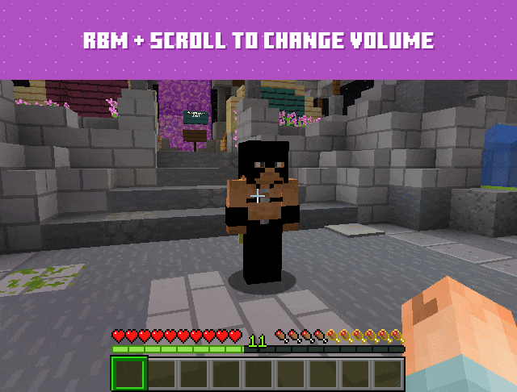

# 📞 Голосовой Чат

## [Plasmovoice](https://modrinth.com/mod/plasmo-voice/versions)

* [x] Скачайте и установите [Fabric](https://fabricmc.net/use/installer/) или [Forge](https://files.minecraftforge.net/net/minecraftforge/forge/)&#x20;
* [x] Скачайте [Plasmo Voice](https://modrinth.com/mod/plasmo-voice/versions) и поместите его в папку .minecraft/mods.&#x20;
* [x] Запустите [игру](https://www.minecraft.net/ru-ru) и наслаждайтесь модом.


Для [Fabric](https://fabricmc.net/use/installer/) требуется дополнительно установить [Fabric API](https://www.curseforge.com/minecraft/mc-mods/fabric-api/files)



Чтобы говорить, вам нужно зажимать клавишу <mark style="color:green;">`Alt`</mark>.

Чтобы открыть меню настроек [мода](golosovoi-chat.md#plasmovoice) — нажмите на клавишу <mark style="color:green;">`V`</mark> по умолчанию.


<figure><figcaption>
Для того чтобы изменить звук зажмите ПКМ + Колёсико мышки
</figcaption></figure>


Если вы установили [мод](https://modrinth.com/mod/plasmo-voice/versions) правильно, то у вас должен появится зеленый значок возле вашего ника.

