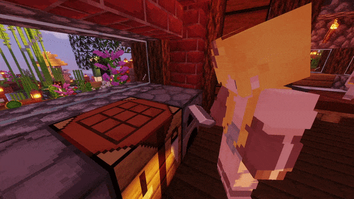
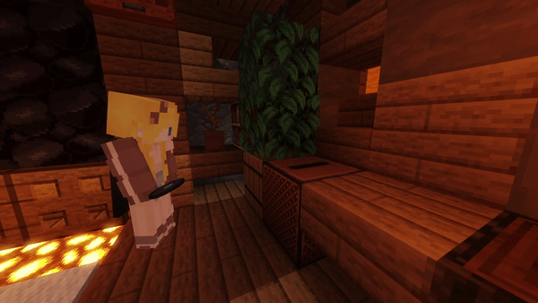

# ⏮ Визуализация блоков

<figure><figcaption></figcaption></figure>

<figure><figcaption></figcaption></figure>


Чтобы отключить <mark style="color:orange;">все</mark> анимации <mark style="color:purple;">/interactionvisualizer toggle all all false</mark>

